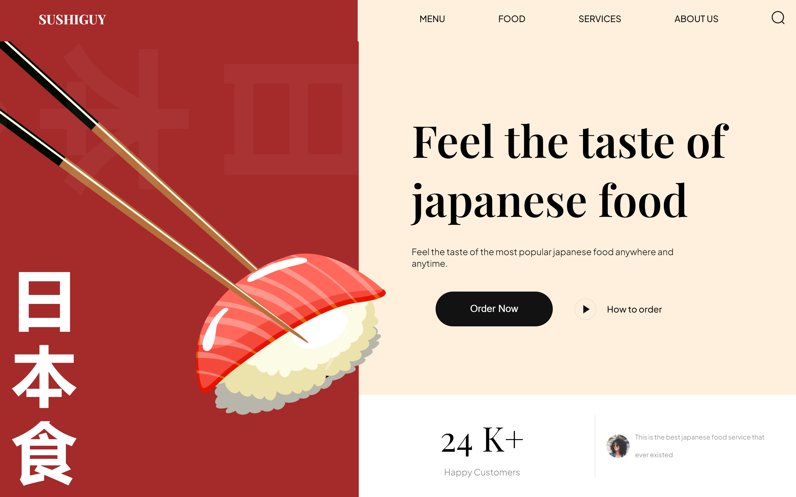

## Welcome! 👋

Thanks for checking out this front-end coding challenge.
please give it a Star == so i can create more of it

3. Open the `index.html` file in your preferred web browser.

## Usage
Once you have the Sushi Website running in your browser, you can:
- Explore the menu by clicking on different sushi items.
- Learn about our restaurant by navigating through the various sections.
- Make reservations by filling out the reservation form.
- Contact us using the provided contact form.

Feel free to customize and enhance the website according to your needs and preferences.

## Contributing
Contributions are welcome! If you have any ideas, suggestions, or bug reports, please submit an issue or create a pull request. We appreciate your input.

## License
This project is licensed under the [MIT License](LICENSE). You are free to use, modify, and distribute the code as per the terms of the license.

---

We hope you enjoy exploring the Sushi Website! If you have any questions or feedback, please don't hesitate to contact us.

Happy sushi tasting!

please give it a Star == so i can create more of it